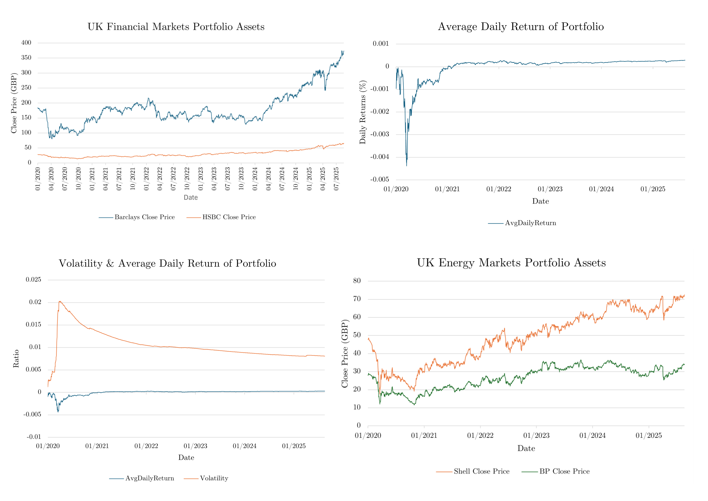
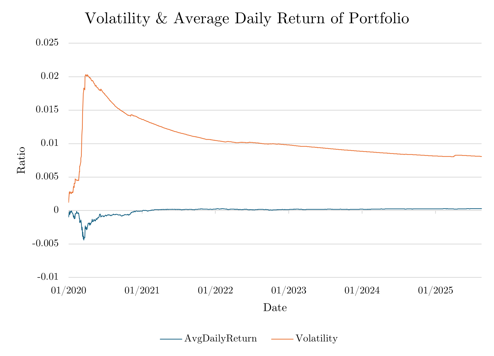

# Portfolio Risk and Investment Analysis of UK Energy and Financial Equities


## 1. Introduction

This project analyses the relationship between market indices of a portfolio based in the UK financial and energy markets, the global index market, UK macroeconomic factors, and portfolio performance between 2020 and 2025. The study examines how macroeconomic variables, such as interest rates, GDP growth, inflation, and commodity prices, influence sector-specific equities and overall portfolio returns.

- [Portfolio Risk & Investment Analysis of UK Equities Research Report](Computational_Portfolio_Analysis_and_Investment_Recommendations__UK_Energy_and_Financial_Markets.pdf)
- [Medium Article Post](https://medium.com/@yusufahmed101/portfolio-risk-investment-analysis-of-uk-equities-a2233df6f0c9)


By combining historical financial data with portfolio simulations (see [`portfolio_analysis.ipynb`](portfolio_analysis.ipynb)), the analysis identifies patterns in asset behaviour, volatility dynamics, and risk-adjusted performance. The project also evaluates the benefits of diversification across sectors and international markets in mitigating portfolio risk during periods of economic uncertainty.

Central Thesis:

> Slow and steady increases in UK interest rates create favourable conditions for investment in the financial sector, particularly banking equities, while diversification across energy and global indices mitigates portfolio volatility and supports consistent risk-adjusted returns.

All data extraction, cleaning, and visualisation are performed using Python, pandas, and Excel. Macroeconomic indicators (GDP, CPI, unemployment, crude oil) are integrated with financial time series for equities, ETFs, and UK government bonds. Portfolio simulations, risk metrics, and scenario testing are implemented in the notebook and output as CSVs in the `output-data/` folder.

## Data Visualisations Summary



## Table of Contents

- [Introduction](#1-introduction)
- [Portfolio Variables](#2-portfolio-variables)
- [Methodology](#3-methodology)
- [Architecture](#4-architecture)
- [Interest Rates, UK Financial Markets, and Portfolio Returns](#5-interest-rates-uk-financial-markets-and-portfolio-returns)
- [Energy Markets, Crude Oil, and Portfolio Returns](#6-energy-markets-crude-oil-and-portfolio-returns)
- [Market Indices, Risk, and Portfolio Dynamics](#7-market-indices-risk-and-portfolio-dynamics)
- [UK Macroeconomic Indicators](#8-uk-macroeconomic-indicators)
- [Portfolio Simulation Scenario: Rising UK Interest Rates](#9-portfolio-simulation-scenario-rising-uk-interest-rates)
- [Financial Analysis](#10-financial-analysis)
- [Conclusion](#11-conclusion)
- [References](#12-references)

## 2. Portfolio Variables

Key Indices and Macroeconomic Indicators Considered:

| Category         | Items                                                                 |
|------------------|-----------------------------------------------------------------------|
| Equities/Indices | BP plc (GBP), Shell PLC (GBP), HSBC Holdings (GBP), Barclays PLC (GBP), FTSE 100 (GBP), S&P 500 (USD) |
| Macroeconomic    | UK GDP, 10-Year UK Government Bond Yields, UK CPI, UK Unemployment Rate, Brent Crude Oil Prices |

Portfolio Weights:
- UK Financial Markets: 30% (HSBC 15%, Barclays 15%)
- UK Energy Markets: 20% (BP 10%, Shell 10%)
- FTSE 100: 10%
- S&P 500: 40%

Key Metrics:
- Portfolio return, volatility, Sharpe ratio, cumulative return, benchmark daily return (S&P 500), macroeconomic variables (GDP, CPI, unemployment, crude oil)

## 3. Methodology

### 3.1 Data Collection and Preprocessing
```python
from dotenv import load_dotenv
import yfinance as yf
import pandas as pd
from fredapi import Fred
import pandasql as ps
from pandasql import sqldf
import requests
import statistics
import math
import numpy as np
import os

# UK Energy Markets
bp = yf.Ticker('BP')
shell = yf.Ticker('SHEL')

# UK Financial Markets
hsbc = yf.Ticker('HSBC')
barclays = yf.Ticker('BARC.L')

# UK / Global ETFs
ftse_100 = yf.Ticker('^FTSE')
s_and_p_500 = yf.Ticker('^GSPC')

# UK 10 Year Gilt Government Bond
load_dotenv()
fred_api_key = os.getenv('FRED_API_KEY')
fred = Fred(fred_api_key)

bond_yield_data = fred.get_series('IRLTLT01GBM156N')

# UK Unemployment
uk_unemployment = fred.get_series('LRUNTTTTGBQ156S')

# UK Consumer Price Index (CPI)
uk_cpi = fred.get_series('GBRCPIALLMINMEI')

# UK Gross Domestic Product (GDP)
gdp_url = 'https://api.worldbank.org/v2/country/GBR/indicator/NY.GDP.MKTP.CD?format=json'
gdp_response = requests.get(gdp_url).json()

# Crude Oil Prices
crude_oil = fred.get_series('GBRCPIALLMINMEI', observation_start='2015-01-01', observation_end='2025-01-01')
```

### 3.2 Exploratory Data Analysis
- Visual exploration in Excel and Power BI.
- Interactive dashboards and annotated time series for trends and volatility.

### 3.3 Portfolio Metrics Calculation
```python
def portfolio_average_daily_return(stock_dfs, weights, start_date, end_date):
    # Get daily returns for each stock
    daily_returns_lists = [daily_returns_list(stock, start_date, end_date) for stock in stock_dfs]

    # Combine weighted daily returns
    portfolio_daily_returns = [
        sum(weight * ret for weight, ret in zip(weights, daily_returns))
        for daily_returns in zip(*daily_returns_lists)
    ]

    # Return average daily return
    return sum(portfolio_daily_returns) / len(portfolio_daily_returns)
```

### 3.4 Simulation and Stress Testing
- Scenario analysis: shocks to financial sector, accelerated return simulations.
- Visualisation with matplotlib.

### 3.5 Automation and Reproducibility
- All scripts and analyses are in [`portfolio_analysis.ipynb`](portfolio_analysis.ipynb).
- Outputs (cleaned data, metrics, simulations) are saved in [`output-data/`](output-data/).

## 4. Architecture

The architecture of this project integrates multiple APIs and tools to streamline data extraction, processing, and visualissssation. The workflow is illustrated below:


### Components:

1. **Yahoo Finance API**: Used for retrieving historical stock prices and ETF data.
2. **FRED API**: Provides macroeconomic indicators such as bond yields, unemployment rates, and CPI.
3. **World Bank API**: Supplies GDP data for the UK.
4. **Python**: Core programming language for data extraction, cleaning, and analysis.
5. **Excel**: Used for intermediate data exploration and annotation.
6. **Power BI**: Enables interactive dashboards and visualisations for portfolio insights.

## 5. Interest Rates, UK Financial Markets, and Portfolio Returns


### Formulae
```python
def daily_return_gov_bonds():
    temp = (ps.sqldf(f"""
    SELECT
        Date(Date) as 'date',
        Yield as yield,
        LAG(Yield, 1) OVER (ORDER BY Date) as previous_yield
    FROM
        government_bond
    WHERE Date > '2025-06-01'
    """))

    r_t = 0
    p_t = temp.loc[1, 'yield']
    p_t_prev = temp.loc[1, 'previous_yield']

    r_t = (p_t - p_t_prev) / p_t_prev

    return r_t
```

### Observations
- Gradual increases in bond yields support financial sector performance.
- Sudden spikes/drops in yields cause short-term shocks.
- Portfolio returns are smoothed by diversification.

## 6. Energy Markets, Crude Oil, and Portfolio Returns




### Observations
- BP and Shell prices are highly correlated with crude oil.
- Energy market shocks cause sharp drops in portfolio returns.
- Diversification cushions energy sector volatility.

## 7. Market Indices, Risk, and Portfolio Dynamics


### Observations
- Portfolio performance closely tracks S&P 500 and FTSE 100.
- Volatility spikes during market crashes, falls during bull runs.
- Sharpe ratio is lowest during volatility spikes, rises as volatility declines.

## 8. UK Macroeconomic Indicators


### Observations
- Unemployment and GDP show non-linear, state-dependent relationships.
- CPI rises steadily, indicating inflationary pressures.
- Portfolio exposure to macro-sensitive sectors reacts to these cycles.

## 9. Portfolio Simulation Scenario: Rising UK Interest Rates


### Observed Relationships
- Gradual yield increases support financial sector returns.
- Sudden yield shocks cause volatility and short-term losses.
- Diversification smooths, but does not eliminate, rate shock effects.

### Investment Recommendation
- Favour UK financials (Barclays, HSBC) when yields rise gradually.
- Reduce exposure if yields spike sharply.
- Maintain diversification to smooth volatility.

## 10. Analysis

- Gradual UK interest rate increases improve bank profitability and portfolio stability.
- Energy market shocks influence financials via inflation and monetary policy.
- Diversification mitigates, but does not eliminate, macroeconomic risk.
- Correlation analysis: financials track bond yields, energy tracks commodities.

## 11. Conclusion

- Steady rate increases favour financial sector investments (Barclays, HSBC).
- Portfolio is most stable with gradual, predictable macroeconomic changes.
- Diversification across sectors and geographies smooths volatility.
- Future work: stress testing, scenario modelling, machine learning forecasts.

## 12. References

- Yahoo Finance API: https://finance.yahoo.com/
- FRED API: https://fred.stlouisfed.org/
- World Bank API: https://data.worldbank.org/
- See [`portfolio_analysis.ipynb`](portfolio_analysis.ipynb) and [`output-data/`](output-data/) for code and data.